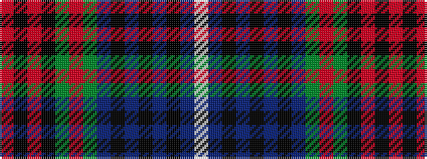

RKRKGRGBKBKBKBW

It is a 15 stripe tartan.

<figure class="pat-woven">

<figcaption>idealised sample</figcaption>
</figure>

## Colour Sequence



## Tartans with this colour sequence

| Tartans |
|---------------|
| [Joseph Linn Family (Monohon) Name Tartan](/variants/s15/w3db3k1db3k1db15k1db2g15o1g2ki20o1ki2o2~x2/)|
||
