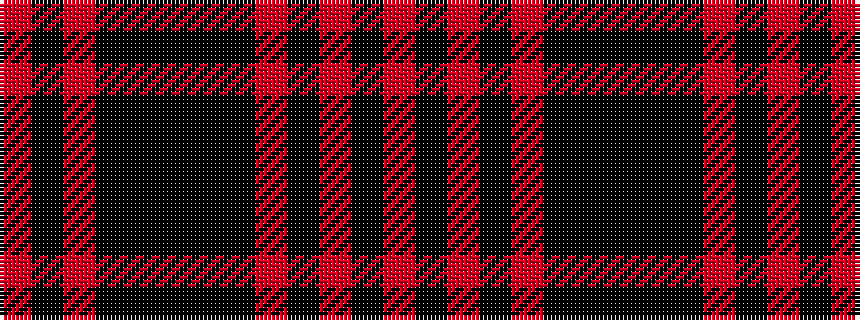

RKRKKKKKRKRKR

It is a 13 stripe tartan.

<figure class="pat-woven">

<figcaption>idealised sample</figcaption>
</figure>

## Colour Sequence



## Tartans with this colour sequence

| Tartans |
|---------------|
| [Red, White, Blue Watch (Dance)](/setts/s13/r12k2r2k2r2k10ki12k3ki12k10r12k2r2~x2/)|
||
