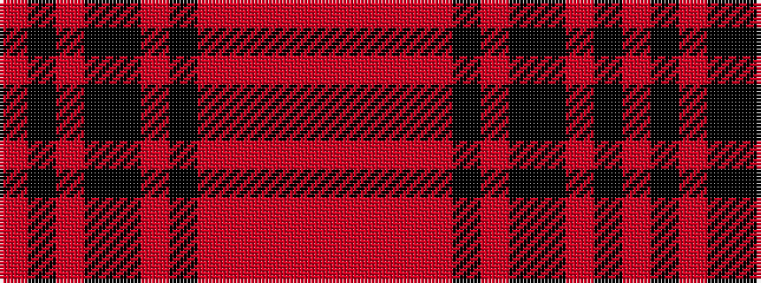

RKRKKRKRRRRR

It is a 12 stripe tartan.

<figure class="pat-woven">

<figcaption>idealised sample</figcaption>
</figure>

## Colour Sequence



## Tartans with this colour sequence

| Tartans |
|---------------|
| [Kinloch Anderson Limited](/setts/s12/r4o14o2o4o2k6o3k6k14r2k4r4~x2/)|
||
