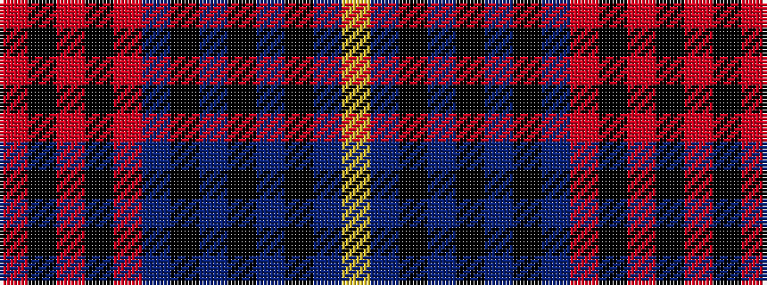

RKRKRBKBKBKBY

It is a 13 stripe tartan.

<figure class="pat-woven">

<figcaption>idealised sample</figcaption>
</figure>

## Colour Sequence



## Tartans with this colour sequence

| Tartans |
|---------------|
| [Etihad Airways](/variants/s13/o6k28o4k4o12dr32k4dr3k4dr3k4dr14ly4/)|
||
