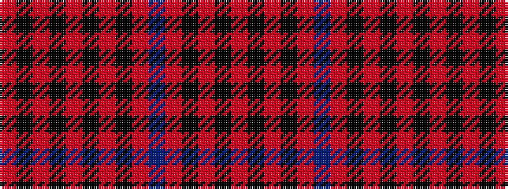

RKRKRBRKRKRKRKR

It is a 15 stripe tartan.

<figure class="pat-woven">

<figcaption>idealised sample</figcaption>
</figure>

## Colour Sequence



## Tartans with this colour sequence

| Tartans |
|---------------|
| [Walkers Shortbread (Corporate)](/setts/s15/r5k1r2k2r16t2r2k9r2k2r2k13r2k2r4~x2/)|
||
