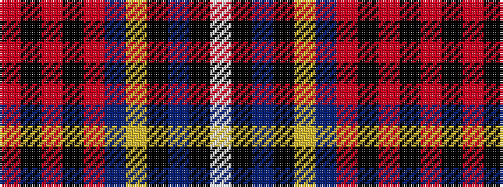

RKRKRBYKBKW

It is a 11 stripe tartan.

<figure class="pat-woven">

<figcaption>idealised sample</figcaption>
</figure>

## Colour Sequence



## Tartans with this colour sequence

| Tartans |
|---------------|
| [Cork County Crest (Fashion)](/setts/s11/r7k6r62k15r20n15lo10k16db10k3w6/)|
||
