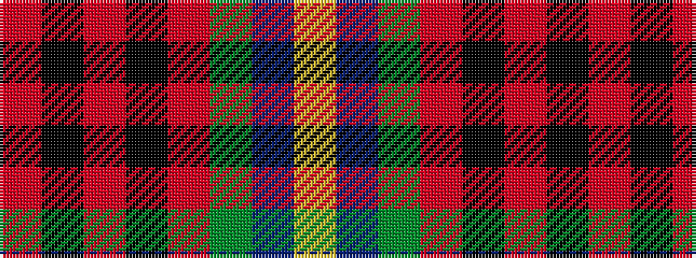

RKRKRGBY

It is a 8 stripe tartan.

<figure class="pat-woven">

<figcaption>idealised sample</figcaption>
</figure>

## Colour Sequence



## Tartans with this colour sequence

| Tartans |
|---------------|
| [Sikh](/setts/s8/o56k12o7k12o7g50db50ly10/)|
||
| [Sikh (Corporate)](/setts/s8/o30k4o3k4o3g20dt20ly4~x2/)|
||
