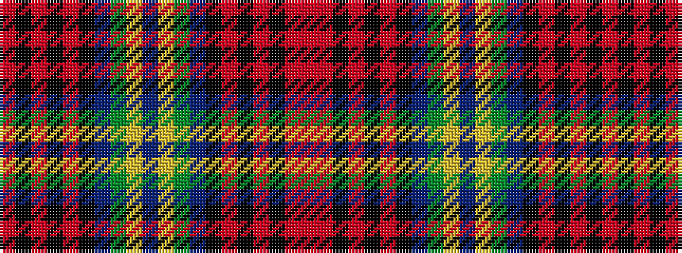

RKRKRKBGYBYGBKRKRKRR

It is a 20 stripe tartan.

<figure class="pat-woven">

<figcaption>idealised sample</figcaption>
</figure>

## Colour Sequence



## Tartans with this colour sequence

| Tartans |
|---------------|
| [Blais Family Tartan Tartan Number: 2321. Earliest known date: 1997 For Francine Paquet Blais's Canadian family with a direct line of descent from 1669. (STS) See products available Copyright © Blair Urquhart, Comrie, 2015](/setts/s20/db20ly1dy1db3k1o2k1r10k1o2r4~x2/)|
||
