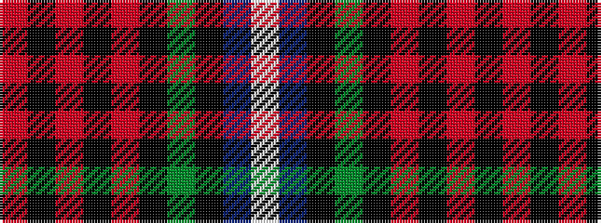

RKRKRKGKBW

It is a 10 stripe tartan.

<figure class="pat-woven">

<figcaption>idealised sample</figcaption>
</figure>

## Colour Sequence



## Tartans with this colour sequence

| Tartans |
|---------------|
| [Leitrim County, Crest Range](/variants/s10/o10k24o5k13o24k5dg52k5db18w8/)|
||
