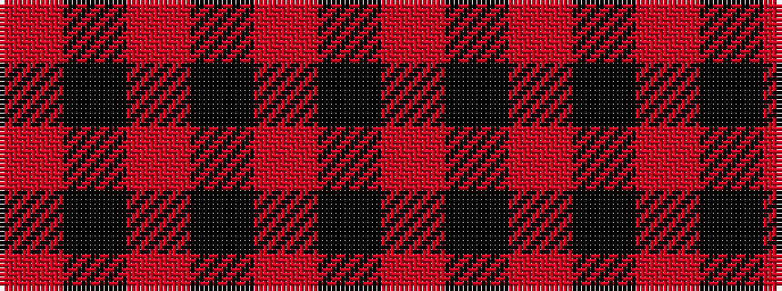

RKRKRKR

It is a 7 stripe tartan.

<figure class="pat-woven">

<figcaption>idealised sample</figcaption>
</figure>

## Colour Sequence



## Tartans with this colour sequence

| Tartans |
|---------------|
| [Dunbar, John Telfer (Personal)](/variants/s7/o5k2o28k10o26k4o4~x2/)|
||
| [Scott Black & Grey (Corporate)](/variants/s7/o8k3o17k13o6k3o4~x2/)|
||
| [Sunderland of Scotland (Fashion)](/variants/s7/r1k9o5k3o5k21o1~x4/)|
||
