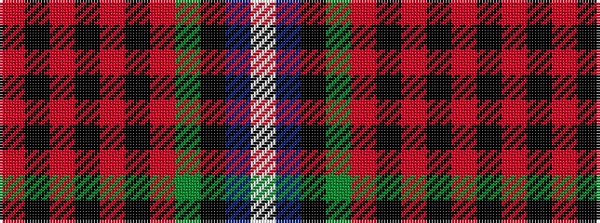

RKRKRKRGKBW

It is a 11 stripe tartan.

<figure class="pat-woven">

<figcaption>idealised sample</figcaption>
</figure>

## Colour Sequence



## Tartans with this colour sequence

| Tartans |
|---------------|
| [Malawi](/setts/s11/r16k4r2k4r2k8r8dg8k1db16w4~x2/)|
||
