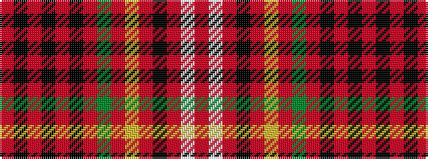

RKRKRKRGRYRKRWR

It is a 15 stripe tartan.

<figure class="pat-woven">

<figcaption>idealised sample</figcaption>
</figure>

## Colour Sequence



## Tartans with this colour sequence

| Tartans |
|---------------|
| [Ainslie](/variants/s15/r6k2r2k4r2k2r6g18r2ly1r2k1r10w1r2~x4/)|
||
| [Ainslie #2](/variants/s15/r6k2r2k4r2k2r6g18r2lo1r2k2r10w1r2~x4/)|
||
