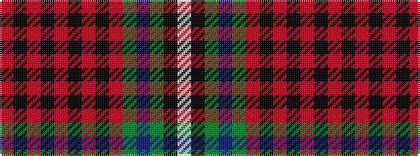

RKRKRKRKRGBGKW

It is a 14 stripe tartan.

<figure class="pat-woven">

<figcaption>idealised sample</figcaption>
</figure>

## Colour Sequence



## Tartans with this colour sequence

| Tartans |
|---------------|
| [Hitchens, William Henry (Commem)](/setts/s14/r4k2r2k2r2k2ri8k6ri2g2dt9g2k21w4~x2/)|
||
