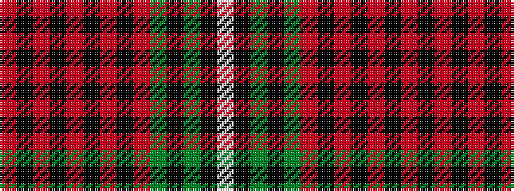

RKRKRKRKRGKGKW

It is a 14 stripe tartan.

<figure class="pat-woven">

<figcaption>idealised sample</figcaption>
</figure>

## Colour Sequence



## Tartans with this colour sequence

| Tartans |
|---------------|
| [Hitchens, William Henry](/variants/s14/r4ki2r2ki2r2ki2ri8ki6ri2g2k9g2ki21w4~x2/)|
||
