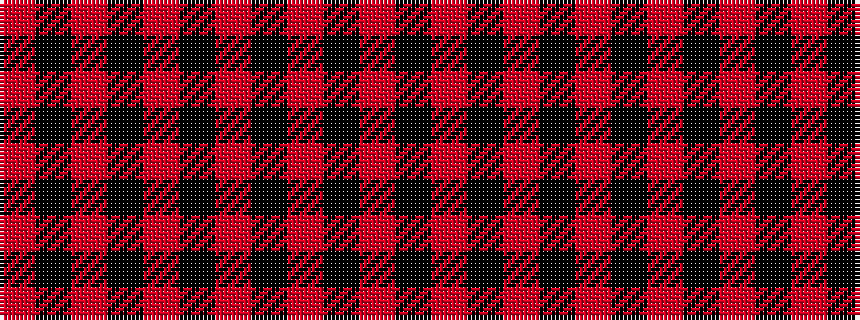

RKRKRKRKRKR

It is a 11 stripe tartan.

<figure class="pat-woven">

<figcaption>idealised sample</figcaption>
</figure>

## Colour Sequence



## Tartans with this colour sequence

| Tartans |
|---------------|
| [Border Reiver, The](/setts/s11/r5k5r2k1r1k1r2k5r5k1r2~x4/)|
||
| [Impulse (Fashion)](/setts/s11/r2k10r9k13r7k3r2k3r2k3r2~x2/)|
||
