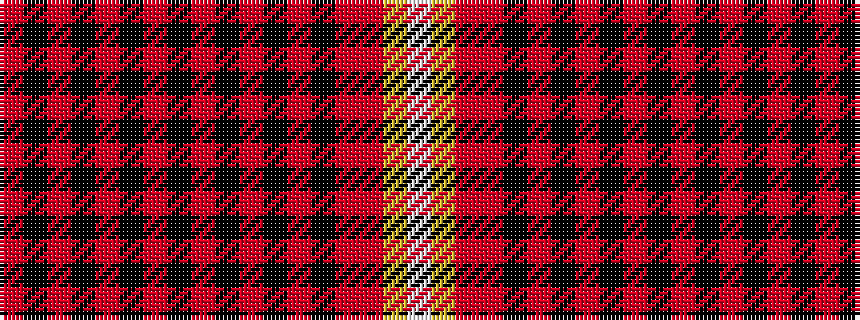

RKRKRKRKRKRKRKRRYW

It is a 18 stripe tartan.

<figure class="pat-woven">

<figcaption>idealised sample</figcaption>
</figure>

## Colour Sequence



## Tartans with this colour sequence

| Tartans |
|---------------|
| [Read Dress, Peter (Personal)](/variants/s18/o8k24oi1k1oi1k1oi1k1oi8k1oi1k1oi1k1oi1o20ly1w1~x2/)|
||
