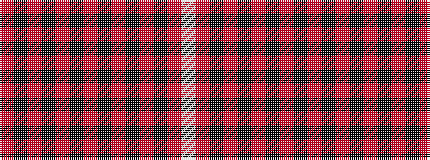

RKRKRKRKRKRKRW

It is a 14 stripe tartan.

<figure class="pat-woven">

<figcaption>idealised sample</figcaption>
</figure>

## Colour Sequence



## Tartans with this colour sequence

| Tartans |
|---------------|
| [Chicago, University of](/setts/s14/r30k8r2k2r4k2r32k2r4k2r2k8r30lb3~x2/)|
||
