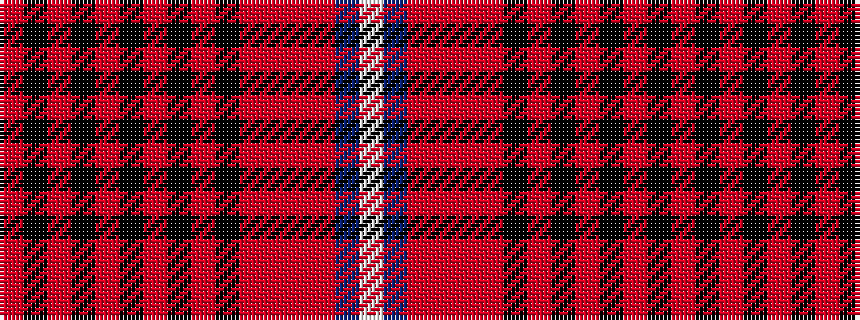

RKRKRKRKRKRRRRBW

It is a 16 stripe tartan.

<figure class="pat-woven">

<figcaption>idealised sample</figcaption>
</figure>

## Colour Sequence



## Tartans with this colour sequence

| Tartans |
|---------------|
| [Mehrtens (Personal)](/setts/s16/w4dt4r18o4r1o36ki1o4ki6r2ki6r6ki2r6k4r2~x2/)|
||
