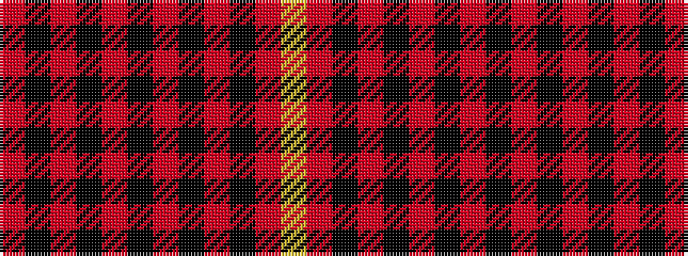

RKRKRKRKRKRY

It is a 12 stripe tartan.

<figure class="pat-woven">

<figcaption>idealised sample</figcaption>
</figure>

## Colour Sequence



## Tartans with this colour sequence

| Tartans |
|---------------|
| [Calgary, University of (Estimated Threadcount)](/variants/s12/r8k1r1k5r1k1r8k1r1k30r1ly2~x2/)|
||
| [German National (US) (Fashion)](/variants/s12/r16k2r2k2r13k12r2k12r13k13r2ly2~x2/)|
||
