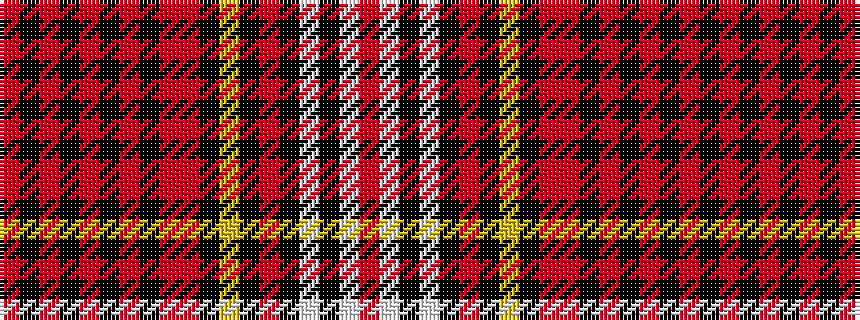

RKRKRKRKRRKYKRKWKWR

It is a 19 stripe tartan.

<figure class="pat-woven">

<figcaption>idealised sample</figcaption>
</figure>

## Colour Sequence



## Tartans with this colour sequence

| Tartans |
|---------------|
| [Douglas Ancient Dress (WCWM)](/setts/s19/r6k6o1k6o1k2o5k1o5r3k2ly3k2o3k8w11k2w4o2~x2/)|
||
