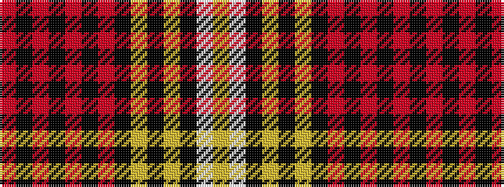

RKRKRKRKYKYKWY

It is a 14 stripe tartan.

<figure class="pat-woven">

<figcaption>idealised sample</figcaption>
</figure>

## Colour Sequence



## Tartans with this colour sequence

| Tartans |
|---------------|
| [Desert](/variants/s14/lo70w3k2ly1k2ly1k5r1k5r2k7r2k7r3~x2/)|
||
