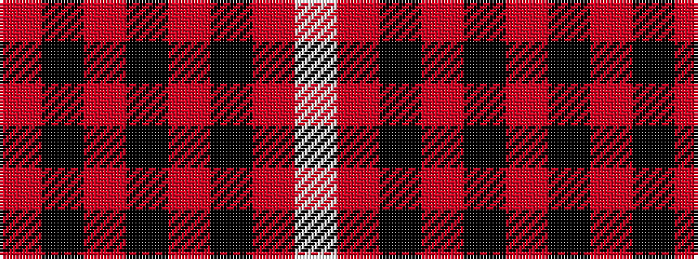

RKRKRKRW

It is a 8 stripe tartan.

<figure class="pat-woven">

<figcaption>idealised sample</figcaption>
</figure>

## Colour Sequence



## Tartans with this colour sequence

| Tartans |
|---------------|
| [University of Chicago (Corporate)](/variants/s8/r32k2r4k2r2k8r30lb3~x2/)|
||
