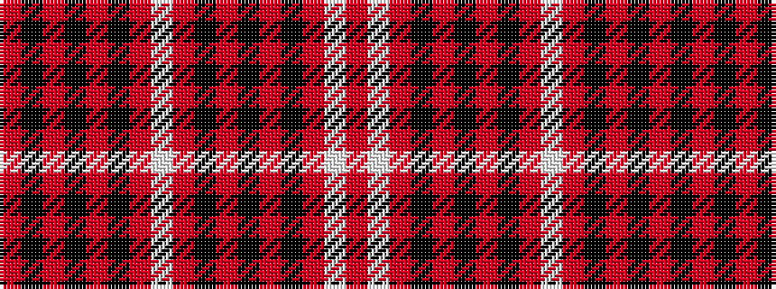

RKRKRKRWRKRKRKRWR

It is a 17 stripe tartan.

<figure class="pat-woven">

<figcaption>idealised sample</figcaption>
</figure>

## Colour Sequence



## Tartans with this colour sequence

| Tartans |
|---------------|
| [MacGuinness](/variants/s17/o1w5o1k1o1k1o1k1o1w5o1k24o1k1o1k1o1~x2/)|
||
