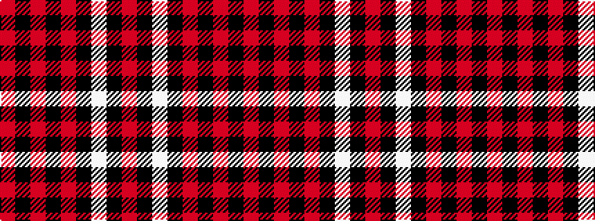

RKRKRKWKR

It is a 9 stripe tartan.

<figure class="pat-woven">

<figcaption>idealised sample</figcaption>
</figure>

## Colour Sequence



## Tartans with this colour sequence

| Tartans |
|---------------|
| [Brand Ambassador](/variants/s9/r4k16w4k16r4k42r20k83r2/)|
||
| [Brand Ambassador (Corporate)](/variants/s9/r2k8w2k8r2k21r10k42r1~x2/)|
||
