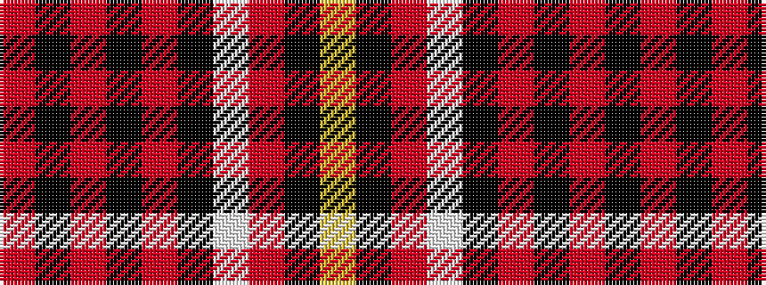

RKRKRKWRKY

It is a 10 stripe tartan.

<figure class="pat-woven">

<figcaption>idealised sample</figcaption>
</figure>

## Colour Sequence



## Tartans with this colour sequence

| Tartans |
|---------------|
| [Barbecue Plaid (Fashion)](/setts/s10/ly2k2r2w8k14r1k1r1k1r1~x2/)|
||
