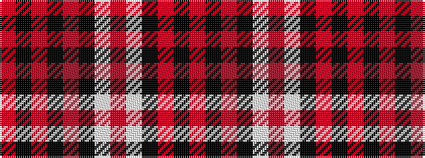

RKRKRKWRWKRKR

It is a 13 stripe tartan.

<figure class="pat-woven">

<figcaption>idealised sample</figcaption>
</figure>

## Colour Sequence



## Tartans with this colour sequence

| Tartans |
|---------------|
| [Poulter SG 103 (Fashion)](/variants/s13/o25k8o8k8o8k46w46r8w46k46o46k8o8/)|
||
