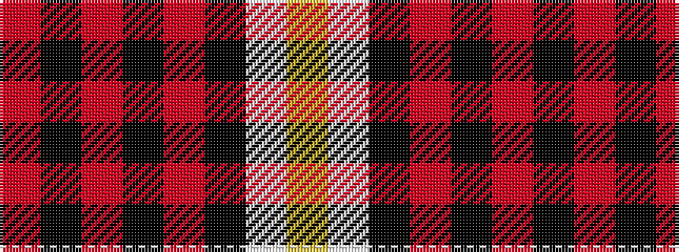

RKRKRKWY

It is a 8 stripe tartan.

<figure class="pat-woven">

<figcaption>idealised sample</figcaption>
</figure>

## Colour Sequence



## Tartans with this colour sequence

| Tartans |
|---------------|
| [Aberdeen F.C.](/setts/s8/o5k1r2k4r36k23w4ly2~x2/)|
||
| [Aberdeen Football Club (1999)](/setts/s8/r5k1r2k4r36k23w4ly2~x2/)|
||
