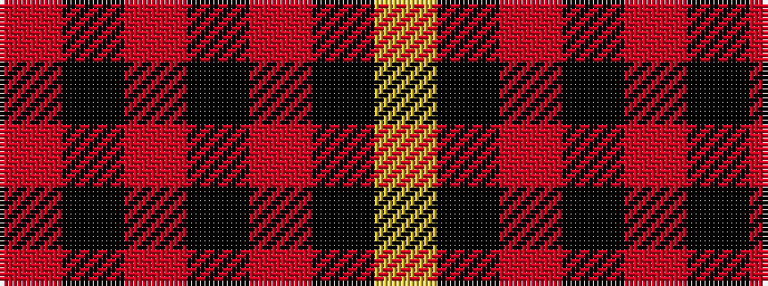

RKRKRKY

It is a 7 stripe tartan.

<figure class="pat-woven">

<figcaption>idealised sample</figcaption>
</figure>

## Colour Sequence



## Tartans with this colour sequence

| Tartans |
|---------------|
| [MacIain](/setts/r4k8r4k8r12k1ly2/)|
||
| [MacIan](/variants/s7/r2k4r2k4r6k1lo1~x4/)|
||
| [MacKeane (Clan?)](/variants/s7/r4k8r4k8r12k1ly1~x2/)|
||
