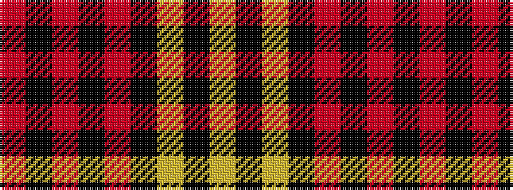

RKRKRKYKY

It is a 9 stripe tartan.

<figure class="pat-woven">

<figcaption>idealised sample</figcaption>
</figure>

## Colour Sequence



## Tartans with this colour sequence

| Tartans |
|---------------|
| [Magdalene (Commemorative)](/variants/s9/ly2k4ly1k4r5k50o1k2r1~x2/)|
||
