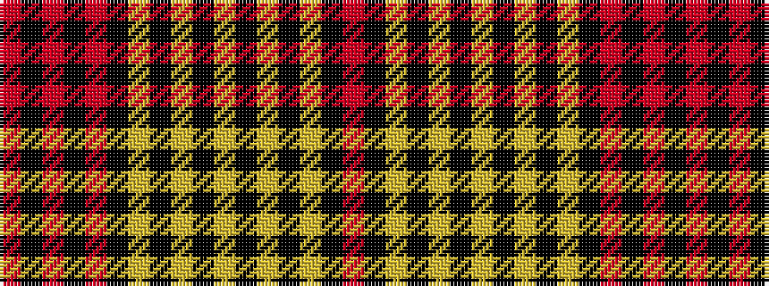

RKRKRKYKYKYKYKYKR

It is a 17 stripe tartan.

<figure class="pat-woven">

<figcaption>idealised sample</figcaption>
</figure>

## Colour Sequence



## Tartans with this colour sequence

| Tartans |
|---------------|
| [Aubigny Auld Alliance District Tartan](/variants/s17/r9k9ly4k2ly3k2ly20k2ly3k2ly4k9r18k2r5k2r9~x2/)|
||
