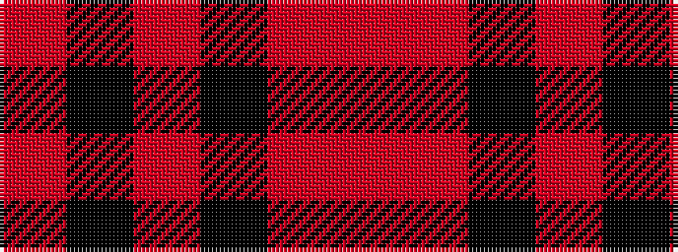

RKRKRR

It is a 6 stripe tartan.

<figure class="pat-woven">

<figcaption>idealised sample</figcaption>
</figure>

## Colour Sequence



## Tartans with this colour sequence

| Tartans |
|---------------|
| [Rosser (Welsh Name)](/variants/s6/r16k57r36k2r4r2/)|
||
