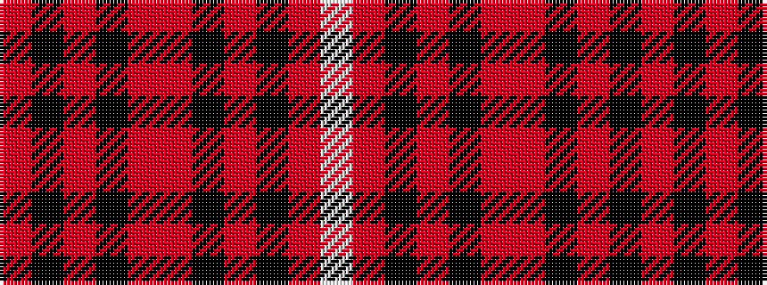

RKRKRRKRKRW

It is a 11 stripe tartan.

<figure class="pat-woven">

<figcaption>idealised sample</figcaption>
</figure>

## Colour Sequence



## Tartans with this colour sequence

| Tartans |
|---------------|
| [Lunch with an Old Bag Charity, The](/setts/s11/r3k15r2k2r6o16k3o2k3o9w2~x2/)|
||
