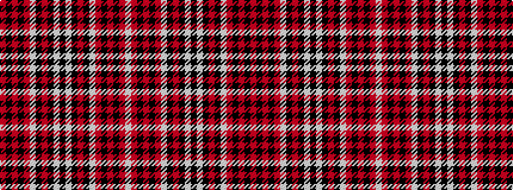

RKRKRWKRKWKWKRKWRKRKRW

It is a 22 stripe tartan.

<figure class="pat-woven">

<figcaption>idealised sample</figcaption>
</figure>

## Colour Sequence



## Tartans with this colour sequence

| Tartans |
|---------------|
| [Knights Templar Dress](/variants/s22/r4k2r11k14r2w2k2r2k10w4k50w4k10r2k2w2r2k14r11k2r4w2~x2/)|
||
