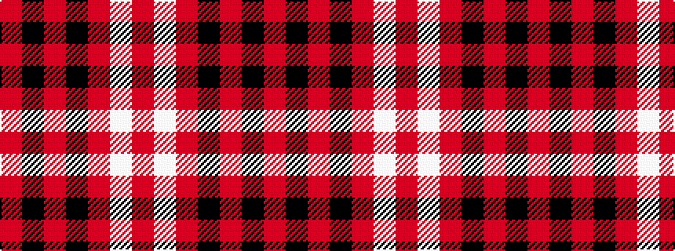

RKRKRWR

It is a 7 stripe tartan.

<figure class="pat-woven">

<figcaption>idealised sample</figcaption>
</figure>

## Colour Sequence



## Tartans with this colour sequence

| Tartans |
|---------------|
| [Bon Accord](/setts/s7/r6w3r17k3r3k25r3~x2/)|
||
| [Instakilt, Pink (Fashion)](/setts/s7/m8w4m50k12m4k15mi5~x2/)|
||
