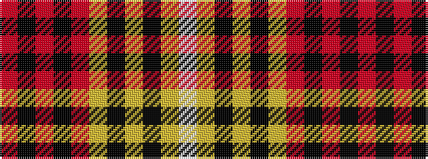

RKRKRYKYKYW

It is a 11 stripe tartan.

<figure class="pat-woven">

<figcaption>idealised sample</figcaption>
</figure>

## Colour Sequence



## Tartans with this colour sequence

| Tartans |
|---------------|
| [Lunch with an Old Bag (Fundraising Committee)](/variants/s11/m3k15m2k2m6lr16k3lr2k3lr9w2~x2/)|
||
