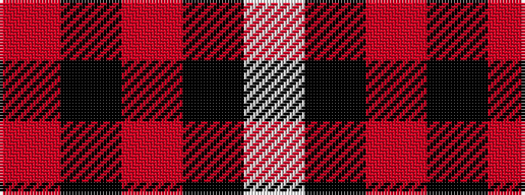

RKRKW

It is a 5 stripe tartan.

<figure class="pat-woven">

<figcaption>idealised sample</figcaption>
</figure>

## Colour Sequence



## Tartans with this colour sequence

| Tartans |
|---------------|
| [Bodog.com](/variants/s5/r3k25r25k10lb3~x2/)|
||
| [Hopkins (Name)](/variants/s5/r36k18r4k7w2~x2/)|
||
| [MacGregor, Black (Personal)](/variants/s5/r41k19r7k9w3~x2/)|
||
| [Masai Shuka 15 (Artefact)](/variants/s5/r20k2r2k15w1~x2/)|
||
| [Turner (Personal)](/variants/s5/r48k12o7k5w3~x2/)|
||
