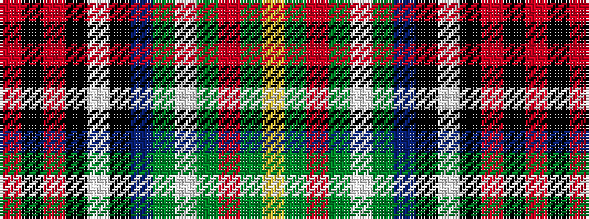

RKRKWKBGWGRGY

It is a 13 stripe tartan.

<figure class="pat-woven">

<figcaption>idealised sample</figcaption>
</figure>

## Colour Sequence



## Tartans with this colour sequence

| Tartans |
|---------------|
| [Nashotah House (Commemorative)](/setts/s13/r2k1m5k7w2k14db8g15w2g7r5g1lo2~x2/)|
||
