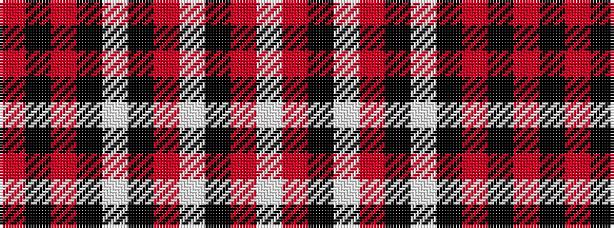

RKRKWKRWKRW

It is a 11 stripe tartan.

<figure class="pat-woven">

<figcaption>idealised sample</figcaption>
</figure>

## Colour Sequence



## Tartans with this colour sequence

| Tartans |
|---------------|
| [Central Washington University Wildcat](/setts/s11/w4r8k7w3r4k5w2k4r6k2r2~x2/)|
||
