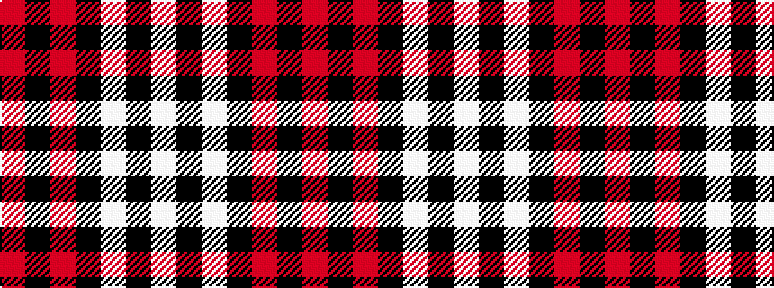

RKRKWKW

It is a 7 stripe tartan.

<figure class="pat-woven">

<figcaption>idealised sample</figcaption>
</figure>

## Colour Sequence



## Tartans with this colour sequence

| Tartans |
|---------------|
| [White Stripes Hunting](/variants/s7/r2k1r2k14w1k1w1~x8/)|
||
