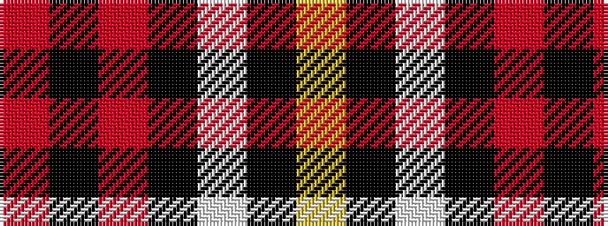

RKRKWKY

It is a 7 stripe tartan.

<figure class="pat-woven">

<figcaption>idealised sample</figcaption>
</figure>

## Colour Sequence



## Tartans with this colour sequence

| Tartans |
|---------------|
| [MacPherson Red Cluny](/setts/s7/r6k3r29k23w4k7ly3~x2/)|
||
