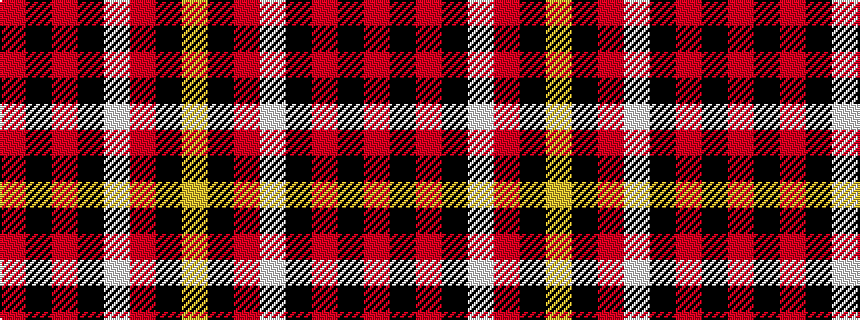

RKRKWRKY

It is a 8 stripe tartan.

<figure class="pat-woven">

<figcaption>idealised sample</figcaption>
</figure>

## Colour Sequence



## Tartans with this colour sequence

| Tartans |
|---------------|
| [Barbecue Plaid](/variants/s8/r45k2r2k28w16r4k4lo2/)|
||
