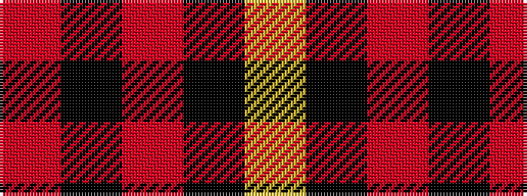

RKRKY

It is a 5 stripe tartan.

<figure class="pat-woven">

<figcaption>idealised sample</figcaption>
</figure>

## Colour Sequence



## Tartans with this colour sequence

| Tartans |
|---------------|
| [Daks - Black House Check, C.6700.06](/variants/s5/o3k7oi4k6ly3~x2/)|
||
| [Haig & Haig Whisky (Corporate)](/variants/s5/r26k18r7k4ly4~x2/)|
||
| [MacKeane](/variants/s5/r4k8r12k1ly1~x2/)|
||
