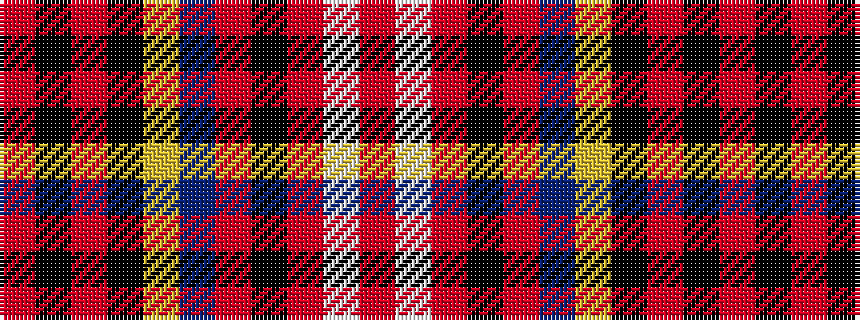

RKRKYBRKRWR

It is a 11 stripe tartan.

<figure class="pat-woven">

<figcaption>idealised sample</figcaption>
</figure>

## Colour Sequence



## Tartans with this colour sequence

| Tartans |
|---------------|
| [Caledonian (WCWM)](/setts/s11/r4lb2r6k2r6do16lo2k12o10k2o1~x2/)|
||
