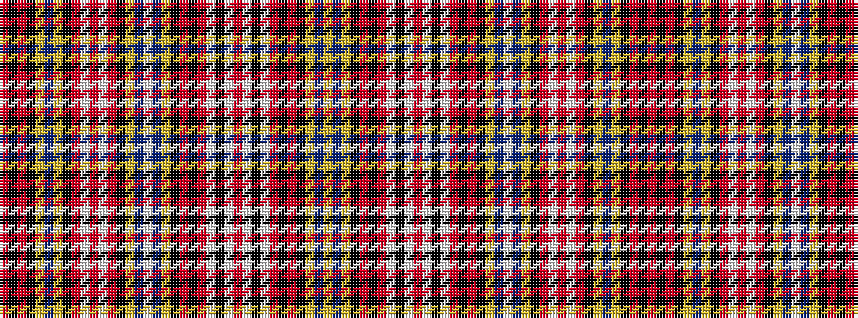

RKRKYBYKRWRWRKYBWBYKRKRWKWRWKWRKRKYBY

It is a 37 stripe tartan.

<figure class="pat-woven">

<figcaption>idealised sample</figcaption>
</figure>

## Colour Sequence



## Tartans with this colour sequence

| Tartans |
|---------------|
| [Ogilvie #3](/variants/s37/r6k6r6k6ly7db7ly7k8r6w5r6w5r6k8ly8db8w7db7ly7k8r8k8r15w2k2w2r14w2k2w2r14k8r8k8ly6db6ly6/)|
||
