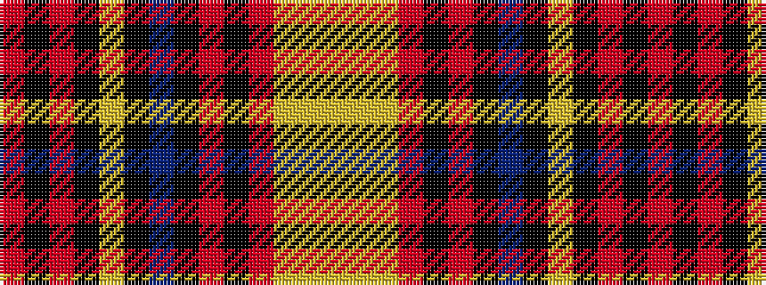

RKRKYKBKRKRYYY

It is a 14 stripe tartan.

<figure class="pat-woven">

<figcaption>idealised sample</figcaption>
</figure>

## Colour Sequence



## Tartans with this colour sequence

| Tartans |
|---------------|
| [Golden Broom](/variants/s14/lg12ly3lg6r19k1ri8k2t4k2lg19k1r19k1ri9~x2/)|
||
