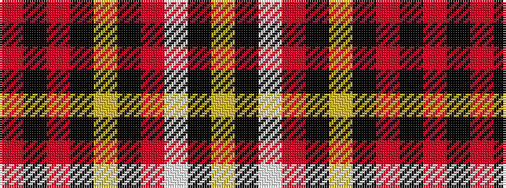

RKRKYKRWKY

It is a 10 stripe tartan.

<figure class="pat-woven">

<figcaption>idealised sample</figcaption>
</figure>

## Colour Sequence



## Tartans with this colour sequence

| Tartans |
|---------------|
| [Unnamed C20th - Skirt](/setts/s10/r58k12r4k2ly2k2r10w5k2ly4~x2/)|
||
