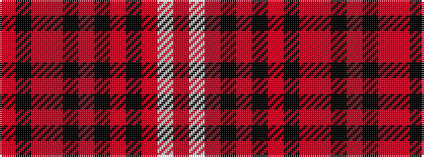

RKRRKRKRKRWR

It is a 12 stripe tartan.

<figure class="pat-woven">

<figcaption>idealised sample</figcaption>
</figure>

## Colour Sequence



## Tartans with this colour sequence

| Tartans |
|---------------|
| [Sweetheart (Fashion)](/setts/s12/r6k7r45r14k10r4k3r6k20r23lb5r6/)|
||
