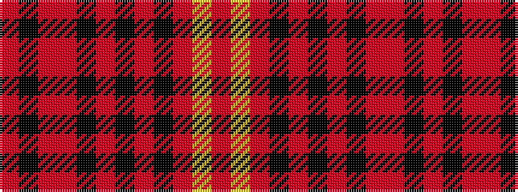

RKRRKRKRKRYR

It is a 12 stripe tartan.

<figure class="pat-woven">

<figcaption>idealised sample</figcaption>
</figure>

## Colour Sequence



## Tartans with this colour sequence

| Tartans |
|---------------|
| [Sweetheart, The](/setts/s12/r6k7r45m14k10o4k3m6k20m23lr5m6/)|
||
