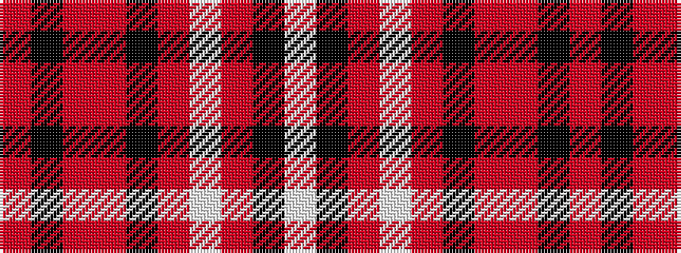

RKRRKRWRKW

It is a 10 stripe tartan.

<figure class="pat-woven">

<figcaption>idealised sample</figcaption>
</figure>

## Colour Sequence



## Tartans with this colour sequence

| Tartans |
|---------------|
| [Pride of Wales (Fashion)](/setts/s10/ri9k2ri2r13k2r2w1ri13k26w2~x2/)|
||
