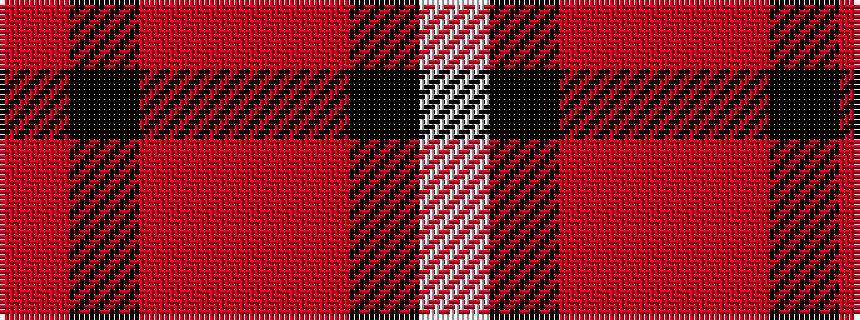

RKRRRKW

It is a 7 stripe tartan.

<figure class="pat-woven">

<figcaption>idealised sample</figcaption>
</figure>

## Colour Sequence



## Tartans with this colour sequence

| Tartans |
|---------------|
| [Ferguson's Promise](/setts/s7/m38k12r15r4r15k2w4~x2/)|
||
| [Ferguson's Promise (Commemorative)](/setts/s7/r38k12r15r4r15k2w4~x2/)|
||
